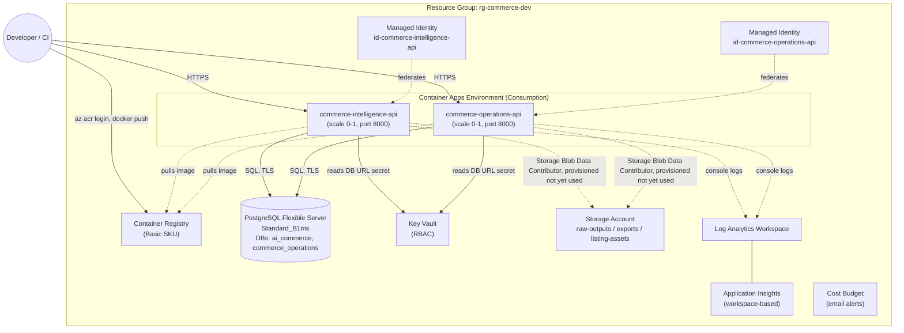

# Phase 2 — Azure DEV architecture

## Scope

This phase deploys the backend API of each Phase 1 application to Azure as two independently
scalable, scale-to-zero Container Apps. The Streamlit UI/dashboard for each app, the
commerce-operations worker, and its one-shot migrate process are **not** deployed as Azure
resources in this phase — see [Deferred components](#deferred-components).

## Diagram

## Design decisions

**Two Container Apps, not five.** Each application ships more than one runnable process
(commerce-intelligence: API + Streamlit UI; commerce-operations: API + worker + Streamlit
dashboard + a one-shot migrate build target). Phase 2 DEV deploys only each app's API —
confirmed with the requester as the intended scope, since the phase's own Definition of Done
speaks of "both" Container Apps and "both" images. The UI, dashboard, and worker processes
are a natural Phase 2.1 addition once the API path is validated end-to-end.

**One Postgres server, two databases.** A single Burstable `Standard_B1ms` Flexible Server
hosts `ai_commerce` (commerce-intelligence) and `commerce_operations` (commerce-operations)
as separate databases — cheaper than two servers, while still keeping each app's schema
isolated. Both apps currently connect with the server admin credential; see
[Security decisions](#security-decisions) for why, and what to change before PROD.

**User-assigned managed identities, created before everything else.** Each app gets its own
identity (`id-commerce-intelligence-api`, `id-commerce-operations-api`), created first so
their principal IDs can be granted `AcrPull`, Key Vault `Secrets User`, and Storage
`Blob Data Contributor` *before* the Container Apps that reference them are created. A
system-assigned identity would hit a create-then-grant race: the platform tries to pull the
image / resolve the Key Vault secret at Container App creation time, before a role assignment
that depends on that identity's principal ID could possibly exist.

**Secrets flow through Key Vault via native references, not duplicated app-level secrets.**
Container Apps' `secrets[].keyVaultUrl` + `identity` lets a revision read a Key Vault secret
directly using its managed identity — no separate copy of the connection string lives in the
Container App's own secret store.

**Bootstrap image placeholder.** `main.bicep` cannot reference an image that doesn't exist yet
in a registry it is simultaneously creating. `intelligenceApiImage` / `operationsApiImage`
default to a small public placeholder; `scripts/deploy-dev.sh` builds and pushes the real
images, then calls `az containerapp update` to point at them. Re-running the Bicep deployment
alone (without the rest of the script) will reset the image back to the placeholder — this is
expected; `deploy-dev.sh` always re-applies the real image afterward in the same run.

**No VNET, no private endpoints.** A Consumption-only Container Apps Environment has no fixed
outbound IP range, so scoping a private Postgres firewall rule to "the Container Apps
Environment" isn't possible without VNET integration (a delegated subnet, workload profiles,
and private DNS) — exactly the "complex networking" this phase is scoped to avoid for an MVP.
See [Security decisions](#security-decisions) for the resulting compromise and its mitigation.

## Deferred components

Not created in this phase — noted here so they aren't mistaken for an oversight:

| Component | Why deferred |
|---|---|
| commerce-intelligence Streamlit UI | Scope decision: API-only for Phase 2 DEV |
| commerce-operations Streamlit dashboard | Scope decision: API-only for Phase 2 DEV |
| commerce-operations worker | Scope decision: API-only for Phase 2 DEV; also has no HTTP health endpoint (CLI-based `--healthcheck`), which Container Apps probes don't support directly |
| commerce-operations migrate as an Azure resource | Run instead as a local/CI `docker run` step against the Azure Postgres server (see `scripts/deploy-dev.sh` step 8), avoiding an extra always-present Container Apps Job for a process that only needs to run once per deploy |
| VNET integration / private endpoints | Adds a delegated subnet, workload profile, and private DNS zone — explicitly out of scope ("complex networking") unless a demonstrated requirement emerges |
| Per-app least-privilege Postgres roles | Both apps currently use the server admin credential (see Security decisions); creating scoped roles declaratively would require a deployment script resource (a hidden container + storage account) for a capability ARM/Bicep doesn't expose natively |

## Security decisions

- **Non-root containers.** Both existing Dockerfiles already run as a non-root user
  (`appuser`/`commerce`) — nothing added or changed here; the images used as-is meet this
  requirement.
- **Managed identities everywhere an app needs to reach another Azure resource** (ACR, Key
  Vault, Storage) — no shared keys or connection secrets baked into images or app settings
  beyond what's stored in Key Vault.
- **Postgres has a public endpoint — a deliberate, documented DEV-only compromise.** Firewall
  rules limit access to (1) Azure-internal services only, via the special
  `0.0.0.0`–`0.0.0.0` rule, not the open internet, and (2) optionally one caller IP for
  running migrations from a developer/CI machine. Before PROD: move to VNET integration with
  a private endpoint and remove the Azure-services rule.
- **`COMMERCE_API_AUTH_ENABLED=false` in DEV.** No API keys are provisioned in this phase, so
  commerce-operations' endpoints (including `/api/v1/*`) are unauthenticated — matching the
  app's own local-development default. This is what allows `/health`, `/ready`, and the smoke
  tests to run without a credential. Before any environment sees real data, enable auth and
  provision `COMMERCE_API_KEYS` / `COMMERCE_API_ROLES` as Key Vault secrets.
- **`COMMERCE_ENVIRONMENT=staging`, not `dev`.** The app's `Settings.environment` field only
  accepts `local | test | staging | production` — there is no `dev` literal. `staging` is the
  closest fit for "deployed, not production." commerce-intelligence has no such constraint
  (`app_env` is a free-form string), so it's set to `dev` directly.
- **Shared Postgres admin credential.** Both apps connect using the server's administrator
  login rather than per-app least-privilege roles, because creating Postgres roles isn't a
  native ARM/Bicep operation — it would require a `Microsoft.Resources/deploymentScripts`
  resource (a hidden container instance + storage account) purely to run SQL. Acceptable for
  an early DEV MVP; revisit before PROD or before either app handles real customer data.
